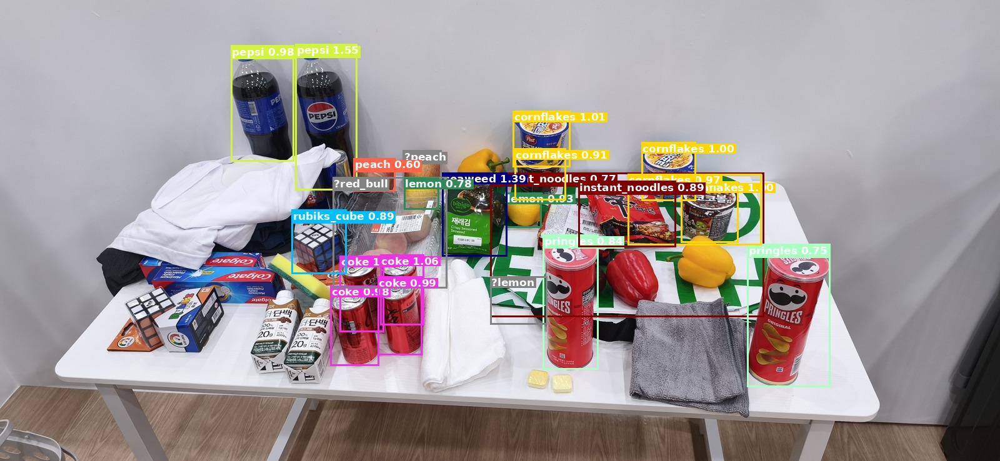

# detecty — RoboCup@Home 객체 검출 파이프라인

> 🇰🇷 한국어 문서가 먼저 나오고, 아래에 영어 원문(English)이 이어집니다.

RoboCup@Home 2026 (인천) 객체를 위한 **객체 검출(object detection) 라이브러리**.
이미지를 넣으면 박스+클래스를 돌려주는 **함수형 호출 API**(`detecty.SamYolo`)를
제공합니다. 파이프라인은 **위치 추정과 분류를 분리**합니다:

1. **위치 추정** — Grounding DINO가 객체 박스를 찾습니다 (클래스 비의존적).
2. **분류** — 각 크롭을 **앙상블**로 분류합니다: DINOv3-L 최근접 프로토타입
   + 마스크된 HSV 색상 + OCR 브랜드 텍스트를 융합하며, 불확실한 검출은
   `review: true` 로 표시합니다(추측하지 않음).

이는 순수 텍스트(Grounding DINO)가 틀리는 브랜드/색상 **쌍둥이(twins)**
(`coke` vs `red_bull`, `pepsi` vs `soju`, 빨강 vs 노랑 파프리카)를 안정적으로
구분합니다.

> **하드웨어:** 대상 GPU는 **1 GB VRAM** — 이 모델들에는 너무 작아 **모든 것이
> 기본적으로 CPU에서 실행**됩니다.

## 데모



```python
from detecty import SamYolo

with SamYolo(device="cpu") as det:           # setup()/shutdown() 자동 처리
    result = det.detect("media/ultimate_test.jpg")
    annotated = det.draw("media/ultimate_test.jpg", result)   # 시각화 PIL 이미지
    annotated.save("media/ultimate_test_result.jpg")

for x in result["detections"]:
    print(x["class"], round(x["score"], 2), x["bbox"], "review" if x["review"] else "")
```

위 밀집 더미에서 앙상블은 쌍둥이를 정확히 맞춥니다 — 펩시 병을 모두 `pepsi`,
빨간 캔을 모두 `coke`, `pringles`/`cornflakes`/`instant_noodles`/`seaweed`/
`rubiks_cube` — 애매한 과일은 회색 `?` 박스(review)로 표시합니다. 또한 혼잡한
장면에서 generic 로컬라이저가 일부 객체를 놓치는 **위치 추정 재현율 한계**도
드러냅니다. 점수는 융합 매칭 점수(확률 아님)라 1.0을 넘을 수 있습니다.

## 함수형 호출 API

```python
SamYolo(config=None, ensemble=None, protos="prototypes.npz",
        dino_model="vit_large_patch16_dinov3.lvd1689m", device="cpu",
        use_ocr=True, use_vlm=False, quantize_localizer=False)

det.setup()                      # 모델 + 프로토타입 뱅크 로드 (멱등)
det.detect(image) -> dict        # image: 경로 또는 PIL.Image
det.detect_batch(images) -> list # 이미지별 dict 리스트
det.draw(image, result) -> PIL   # 라벨 그려진 이미지
det.shutdown()                   # 모델 해제
```

`detect()` 반환값:

```python
{
  "width": int, "height": int,
  "num_detections": int, "num_review": int,
  "detections": [
    {"class": str, "class_id": int,
     "score": float, "margin": float, "candidates": [상위 3개 클래스],
     "bbox": [x1, y1, x2, y2],            # 픽셀
     "bbox_norm": [cx, cy, w, h],         # YOLO 정규화
     "review": bool, "source": "ensemble"|"ocr"|"vlm"},
    ...
  ]
}
```

CLI도 제공합니다:

```bash
detecty-detect media/ultimate_test.jpg --out result.jpg --json result.json
detecty-detect path/to/folder --out annotated/ --json results.json
```

## 설치

```bash
# 1) 플랫폼에 맞는 PyTorch (CPU 빌드 예시; 1 GB GPU는 모델을 못 올림):
pip install torch torchvision --index-url https://download.pytorch.org/whl/cpu

# 2) 패키지 + 추가 의존성
pip install -e .            # 코어: Grounding DINO + DINOv3 앙상블
pip install -e ".[ocr]"     # + EasyOCR 브랜드 매칭 (권장)
pip install -e ".[vlm]"     # + 선택적 Gemma/vLLM 컨설트용 openai 클라이언트
pip install -e ".[all]"     # 전체
```

## 프로토타입 뱅크 준비

검출기는 객체별 참조 임베딩(프로토타입)으로 분류합니다. 객체별 in-domain 크롭
몇 장을 `prototypes/<class>/*.jpg` 에 넣고(많을수록, 특히 쌍둥이에 좋음) 빌드:

```bash
detecty-build-prototypes      # prototypes/ + objects_gt/ -> prototypes.npz
```

`prototypes/` 에 in-domain 크롭이 있는 클래스는 안정적이고, 카탈로그 전용
(`objects_gt/`)만 있는 클래스는 더 자주 review로 갑니다. 클래스 분류 체계는
`src/detecty/data/config.yaml`(공식 [Incheon2026](https://github.com/RoboCupAtHome/Incheon2026/tree/main/objects)
30종)에서 편집합니다.

## 선택적 VLM 컨설트 (기본 꺼짐)

`use_vlm=True`(또는 `detecty-detect --vlm`)는 가장 어려운 크롭에서만 **vLLM** 으로
서빙되는 **Gemma-3n-E4B** 에 질의합니다. 자문용이고 후보 라벨로만 제한되며,
요청하지 않으면 꺼져 있습니다:

```bash
export DETECTY_VLM_URL=http://localhost:8000/v1
export DETECTY_VLM_MODEL=google/gemma-3n-e4b-it
vllm serve google/gemma-3n-e4b-it --max-model-len 4096
```

`src/detecty/vlm_consult.py` 참고.

## 양자화 (Grounding DINO 축소)

`quantize_localizer=True`(또는 `detecty-detect --quantize-localizer`)는 동적
INT8(CPU 전용)을 적용합니다. 측정: 체크포인트 689.6→**254.3 MB**(2.7×), 매칭
박스 IoU ≈ **0.90**, 단 고정 임계값에서 한계 박스 ~25% 누락(임계값 자동 하향으로
보완). PyTorch 동적 INT8은 CPU 전용이라 용량 이점이지 1 GB GPU 경로는 아닙니다.

## 동작 원리 / 비교

| 방법 | 브랜드/색상 쌍둥이 |
|---|---|
| Grounding DINO 텍스트만 | ✗ 브랜드를 못 읽음 (로컬라이저로만 사용) |
| **앙상블 (DINOv3 + 색상 + OCR)** | **✓ coke/red_bull, pepsi, 파프리카 구분** |

분류는 강력하며, 밀집 장면의 **위치 추정 재현율**이 개선 포인트입니다(더 촘촘한
프롬프트 / 더 강한 로컬라이저 / 타일링).

## 프로젝트 구조

```
src/detecty/            # 패키지 (pip 설치 가능)
  pipeline.py           # SamYolo — 함수형 검출 API ⭐
  localize_gd.py        # Grounding DINO 로컬라이저
  embedder.py features.py vlm_consult.py build_prototypes.py
  cli.py                # detecty-detect
  data/config.yaml data/ensemble.yaml
objects_gt/             # 객체별 공식 Incheon2026 참조 사진
prototypes/<class>/*.jpg# 직접 수집한 in-domain 크롭 (프로토타입 뱅크)
```

---

# detecty — RoboCup@Home object detection pipeline

> 🇬🇧 English version (한국어 문서는 위쪽에 있습니다).

An **object-detection library** for the RoboCup@Home 2026 (Incheon) objects,
exposed as a **callable API** (`detecty.SamYolo`): image in → boxes + classes
out. The pipeline **decouples localization from classification**:

1. **Localize** — Grounding DINO finds object boxes (class-agnostic).
2. **Classify** — each crop is classified by an **ensemble**: DINOv3-L
   nearest-prototype + masked HSV colour + OCR brand text, fused; uncertain
   detections are flagged `review: true` rather than guessed.

This reliably resolves the brand/colour **twins** (`coke` vs `red_bull`,
`pepsi` vs `soju`, red vs yellow bell pepper) that pure text (Grounding DINO)
gets wrong.

> **Hardware:** target GPU has **1 GB VRAM** — too small for these models, so
> **everything defaults to CPU**.

## Demo


```python
from detecty import SamYolo

with SamYolo(device="cpu") as det:           # setup()/shutdown() handled
    result = det.detect("media/ultimate_test.jpg")
    annotated = det.draw("media/ultimate_test.jpg", result)   # PIL image
    annotated.save("media/ultimate_test_result.jpg")

for x in result["detections"]:
    print(x["class"], round(x["score"], 2), x["bbox"], "review" if x["review"] else "")
```

On the dense pile above the ensemble nails the twins — both Pepsi bottles as
`pepsi`, all red cans as `coke`, plus `pringles`/`cornflakes`/`instant_noodles`/
`seaweed`/`rubiks_cube` — and flags ambiguous fruit as review (grey `?` boxes).
It also shows the **localizer recall gap**: in heavy clutter the generic
localizer misses some objects. Scores are fused match scores (not probabilities),
so they can exceed 1.0.

## Callable API

```python
SamYolo(config=None, ensemble=None, protos="prototypes.npz",
        dino_model="vit_large_patch16_dinov3.lvd1689m", device="cpu",
        use_ocr=True, use_vlm=False, quantize_localizer=False)

det.setup()                      # load models + prototype bank (idempotent)
det.detect(image) -> dict        # image: path or PIL.Image
det.detect_batch(images) -> list # list of per-image dicts
det.draw(image, result) -> PIL   # annotated image
det.shutdown()                   # free models
```

`detect()` returns:

```python
{
  "width": int, "height": int,
  "num_detections": int, "num_review": int,
  "detections": [
    {"class": str, "class_id": int,
     "score": float, "margin": float, "candidates": [top-3 classes],
     "bbox": [x1, y1, x2, y2],            # pixels
     "bbox_norm": [cx, cy, w, h],         # YOLO-normalized
     "review": bool, "source": "ensemble"|"ocr"|"vlm"},
    ...
  ]
}
```

CLI:

```bash
detecty-detect media/ultimate_test.jpg --out result.jpg --json result.json
detecty-detect path/to/folder --out annotated/ --json results.json
```

## Install

```bash
# 1) PyTorch for your platform (CPU build shown; 1 GB GPU can't fit the models):
pip install torch torchvision --index-url https://download.pytorch.org/whl/cpu

# 2) the package + extras
pip install -e .            # core: Grounding DINO + DINOv3 ensemble
pip install -e ".[ocr]"     # + EasyOCR brand matching   (recommended)
pip install -e ".[vlm]"     # + openai client for the optional Gemma/vLLM consult
pip install -e ".[all]"     # everything
```

## Prepare the prototype bank

The detector classifies via per-object reference embeddings (prototypes). Drop a
few in-domain crops per object into `prototypes/<class>/*.jpg` (more = better,
especially for the twins), then build:

```bash
detecty-build-prototypes      # prototypes/ + objects_gt/ -> prototypes.npz
```

Classes with in-domain crops in `prototypes/` are reliable; catalog-only classes
(`objects_gt/`) land in review more often. Edit the class taxonomy in
`src/detecty/data/config.yaml` (the official
[Incheon2026](https://github.com/RoboCupAtHome/Incheon2026/tree/main/objects) 30).

## Optional VLM consult (off by default)

`use_vlm=True` (or `detecty-detect --vlm`) consults a **Gemma-3n-E4B** model
served by **vLLM** on the hardest crops only — advisory, constrained to the
candidate labels, off unless requested:

```bash
export DETECTY_VLM_URL=http://localhost:8000/v1
export DETECTY_VLM_MODEL=google/gemma-3n-e4b-it
vllm serve google/gemma-3n-e4b-it --max-model-len 4096
```

See `src/detecty/vlm_consult.py`.

## Quantization (shrink Grounding DINO)

`quantize_localizer=True` (or `detecty-detect --quantize-localizer`) applies
dynamic INT8 (CPU-only). Measured: checkpoint 689.6→**254.3 MB** (2.7×),
matched-box IoU ≈ **0.90**, but ~25% of marginal boxes dropped at a fixed
threshold (auto-compensated by lowering the threshold). PyTorch dynamic INT8 is
CPU-only, so it's a footprint win, not a path onto the 1 GB GPU.

## How it works / comparison

| method | brand/colour twins |
|---|---|
| Grounding DINO text only | ✗ can't read brands (used as the localizer) |
| **Ensemble (DINOv3 + colour + OCR)** | **✓ coke/red_bull, pepsi, bell peppers** |

Classification is strong; dense-scene **localization recall** is the thing to
improve (denser prompts / a stronger localizer / tiling).

## Project layout

```
src/detecty/            # the package (pip-installable)
  pipeline.py           # SamYolo — the callable detection API ⭐
  localize_gd.py        # Grounding DINO localizer
  embedder.py features.py vlm_consult.py build_prototypes.py
  cli.py                # detecty-detect
  data/config.yaml data/ensemble.yaml
objects_gt/             # official Incheon2026 reference photo per object
prototypes/<class>/*.jpg# your collected in-domain crops (prototype bank)
```
